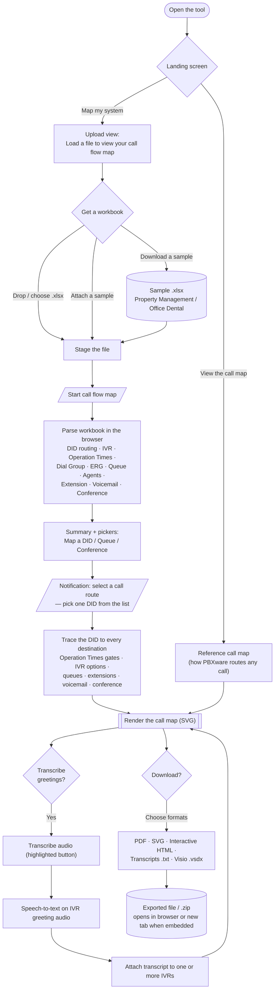

# PBXware Call Flow Map Creator

**Status:** Active · **App version:** v2.43.4 (2026-07-24) · **Owner:** Ron

---

## What it is

A single-file, fully offline web app that turns a PBXware `.xlsx` configuration export into a traced, color-coded diagram of how inbound calls route — DID → Operation Times gates → IVRs (every option) → dial groups, ring groups, queues (with agents), extensions, voicemail and conference bridges, down to each terminating destination. Everything is parsed in the browser; no customer data leaves the machine.

A built-in transcription workbench converts IVR greeting audio to text and attaches the transcript to one or more IVRs on the map, so a map documents both *where* calls go and *what each menu says*.

## Goals

1. Help new techs get familiar with call routing.
2. Create a visual representation of call-flow routing.
3. Transfer current call flow and IVR recordings into voice-IVR prompting.
4. Ultimate goal: connect to PBXware via API and automate call-flow mapping.

## How to use it

1. Open the tool (standalone file, GitHub Pages, or the embed below).
2. Click **Map my system →** and load your PBXware `.xlsx` export — or **Attach** one of the built-in demo workbooks (*Property Management* — standard weekly Operation Times; *Office Dental* — per-day custom Operation Times).
3. Pick a call route (one DID, or a Queue/Conference) and the map renders.
4. Optional: **Transcribe audio** to capture IVR greetings and attach them to the map.
5. **Download…** exports: PDF, SVG, interactive HTML, transcripts (.txt) and editable **Visio (.vsdx)**.

> **Embedding note:** inside a Confluence iframe the browser blocks the native Save dialog, so downloads are delivered via a click-to-download link / new tab. For heavy exporting, use the standalone file or GitHub Pages.

## Application flow

*(Paste the block below into a Mermaid macro on this page to render the diagram.)*

## Key capabilities (v2.43.4)

- In-browser parsing of PBXware exports (DID routing, IVR with optional greeting transcripts, Dial Group, ERG, Extension, Voicemail, Caller ID, Operation Hours, Queues, Agents, Conference).
- Operation Times incl. **per-day custom hours** (a different destination per weekday plus a closed path).
- Transcription workbench with **multi-IVR transcript attach**.
- Exports: PDF, SVG, interactive HTML, transcripts, and **editable Visio (.vsdx)** generated fully in-browser.
- Two sanitized demo workbooks with **Attach** (loads into the tool) and **Download template**.
- Dark mode, tooltips and guided prompts for new users.

## Artifacts

| Item | File |
|---|---|
| Application (single file) | `pbxware_master_call_flow.html` |
| Product requirements | `PRD_PBXware_Call_Flow_Map_Creator.md` |
| Flowchart (rendered / source) | `call_flow_map_creator_flowchart.html` / `.mermaid` |
| Version history | `CHANGELOG.md` |
| Readme | `README.md` |

## Roadmap (summary)

Re-enable the transcriber vault → prompt-inventory workflow for voice-IVR standardization (goal 3) → PBXware API connection and automated map refresh (goal 4). Full detail in the PRD.
